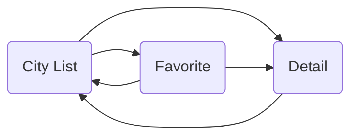

# CityList (MVP)

> Тестовое приложение на основе MVP паттерна, с использованием fragments, navigation component,
> recyclerview, sharedanimation, coordinatorlayout, daynight themes, junit4 и прочее

     

## Базовый функционал
### Приложение с 2мя экранами: 
- Список городов  
- Детальная информация о городе 

### Требования 
- Шаблон: `MVP` 
- Язык: `🇷🇺, 🇬🇧`  
- Ориентация: `portrait | landscape`
- Представления: `фрагменты с navigation component`
- Репозиторий: `заранее заготовленные данные (List<City>)` 
- Прочее: `адаптивная иконка, поддержка светлой/темной темы` 

## Обновление от 16.09

**Экран "Список городов" (Главный)**
- В ActionBar добавить поиск и кнопку перехода к избранному
- RecyclerView - добавить анимации(ripple effects), переделать на ListAdapter (+DiffUtil)
- CardView с кнопкой "добавить в избранное"
- SharedAnimation при переходе к экрану с детальной информацией

**Экран "Детальная информация"**
- Изменить разметку на CoordinatorLayout + анимации
- Кнопка избранное 

**+ Новый экран "Избранное"**
- В ActionBar добавить поиск
- Анимации при удалении

**Тестирование JUnit4**
- Тестирование для presenters

**Прочие исправления**
- Переделать presenter, в конструкторе передавать City вместо args
- Удалить landscape
- Поменять linearlayout на constraintlayout
- Добавить общий style для textview
- Аннотации для ресурсов в аргументах функций
- Ночной режим - доработать стили

